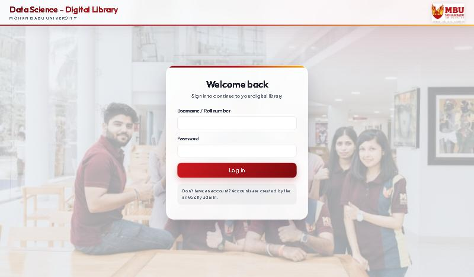
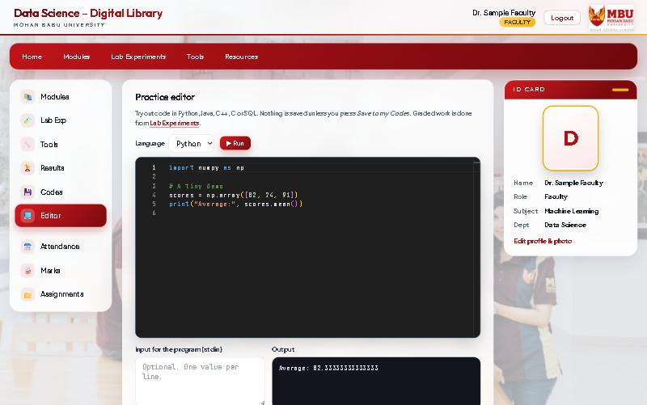
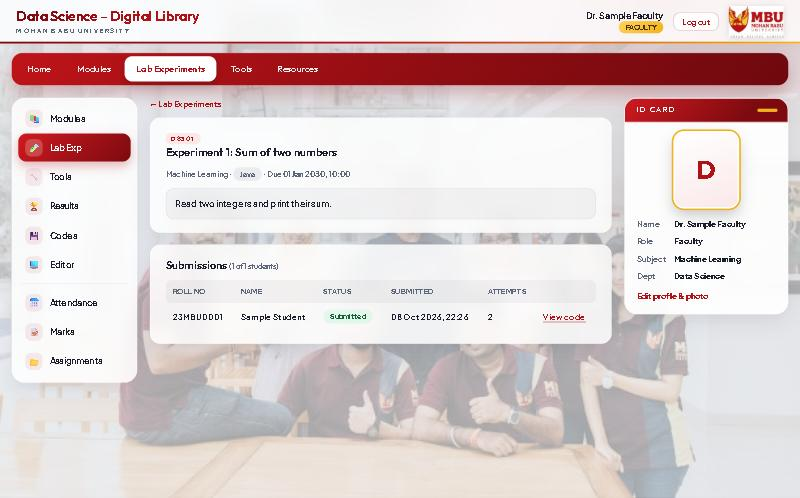

# MBU Digital Library

A college web portal for the **Data Science** department of **Mohan Babu University**. Faculty publish
study material and assignments, run lab experiments in a built-in code editor, take attendance and enter
marks. Students log in to see everything for their semester in one place.

| Login | Code editor | Faculty view of submissions |
|:--:|:--:|:--:|
|  |  |  |

## Features

There are three kinds of accounts. The **admin** creates all accounts; **students** and **faculty** share the
same interface (top menu, side menu, ID card), with different powers inside.

| Area | Students | Faculty |
|------|----------|---------|
| **Modules** | Browse Semester → Subject → Module, open PDFs, watch YouTube videos | Create subjects, add modules, upload PDFs and YouTube links (own subjects only) |
| **Lab experiments** | Solve in the code editor, run, submit (resubmit allowed, late work is flagged) | Assign experiments, see who has and hasn't submitted, read and run each student's code |
| **Assignments** | Upload work (replace until graded), see marks and feedback | Post with due date and maximum marks, download work, grade, reopen for resubmission |
| **Attendance** | Percentage per subject with a warning below 75%, day-by-day list | Take attendance per subject and day, correct past days, report and CSV |
| **Marks and Results** | Marks per assessment, grades, SGPA and CGPA | Define assessments, enter marks in a grid, class statistics, CSV |
| **Tools and Resources** | Search and open links and files | Share links and files, optionally per subject |
| **Codes** | Save snippets from the editor (private), see own lab submissions | Save snippets (private) |
| **Profile** | ID card photo, GitHub, LinkedIn, resume | Same; students see them as logo buttons on the faculty card |

The **code editor** (Monaco, the editor used in VS Code) supports Python (with numpy and pandas), Java, C++, C and SQL.

## Tech stack

- **Backend:** Java 21+, Spring Boot 3.5 (Web, Security, Data JPA, Validation), MySQL 8
- **Frontend:** Thymeleaf templates, HTML, CSS and JavaScript (no framework build step), Monaco editor,
  Pyodide (Python in the browser) and sql.js (SQL in the browser)
- **Fonts:** Outfit and Plus Jakarta Sans (Google Fonts)

## Getting started

### 1. Install

- JDK 21 or newer (a full JDK, not just a JRE)
- Maven 3.9+
- MySQL 8
- Optional, for running C and C++ in the editor: `gcc` and `g++` on your PATH
  (on Windows: `winget install BrechtSanders.WinLibs.POSIX.UCRT`)

### 2. Create the database

Open [`database/setup.sql`](database/setup.sql), **replace `CHANGE_ME_TO_A_STRONG_PASSWORD` with a password of your
own**, and run it in MySQL Workbench as root. It creates the `mbu_library` database and an `mbu_app` user.

### 3. Tell the app the password

The password is never stored in the code. Copy the example settings file and fill in your password:

```bash
cp config/application.example.properties config/application.properties
```

Then edit `config/application.properties`. This file is ignored by git. (Alternatively set the `DB_PASSWORD`
environment variable.)

### 4. Run

Start the app from the project folder (so it finds `config/`):

```bash
mvn spring-boot:run
```

Open <http://localhost:8080>. Tables are created automatically on first start.

## Sample accounts

On first start the app creates three accounts so you can try it straight away:

| Role    | Username   | Password       |
|---------|------------|----------------|
| Admin   | `admin`    | `Admin@123`    |
| Faculty | `faculty1` | `Faculty@123`  |
| Student | `student1` | `Student@123`  |

> **These passwords are public. Do not use them on a real server.** For real use, set
> `app.seed-sample-accounts=false` and `app.initial-admin-password=<your password>` in
> `config/application.properties`, then create the real accounts from the admin dashboard.

## Putting it online

For a free live demo (Render + Aiven MySQL) follow [`DEPLOY.md`](DEPLOY.md). The repository includes a `Dockerfile` and a
`render.yaml` blueprint. Free hosting is for demos only: files are erased when the site sleeps and server-side
Java/C/C++ running is switched off.

## Configuration

Settings go in `config/application.properties` (see [`config/application.example.properties`](config/application.example.properties)).
Defaults live in `src/main/resources/application.properties`.

| Setting | Default | Meaning |
|---------|---------|---------|
| `spring.datasource.password` | (none) | Password of the `mbu_app` MySQL user. Also settable as `DB_PASSWORD` |
| `spring.datasource.url` / `.username` | local MySQL / `mbu_app` | Also `DB_URL`, `DB_USERNAME` |
| `app.upload-dir` | `uploads` | Where photos, PDFs and student files are stored |
| `app.attendance.threshold` | `75` | Attendance percentage below which students get a warning |
| `app.seed-sample-accounts` | `true` | Create the sample accounts on first start |
| `app.initial-admin-password` | (empty) | Creates an `admin` account with this password when sample accounts are off |
| `app.code-runner.enabled` | `true` | Allow running Java, C and C++ programs on the server |
| `app.show-demo-logins` | `false` | Show the sample logins on the sign-in page (public demos only) |
| `PORT`, `COOKIE_SECURE`, `THYMELEAF_CACHE` | `8080`, `false`, `false` | Environment variables for hosting (set by the Dockerfile / host) |
| `app.code-runner.run-timeout-seconds` | `5` | Time limit for a program run |
| `app.code-runner.max-concurrent` | `2` | How many programs may run at the same time |

## Running student code: how it works and what to know

| Language | Runs | Notes |
|----------|------|-------|
| Python, SQL | In the student's own browser | Student code never reaches the server. Needs internet for the first load (CDN) |
| Java, C, C++ | On the server | Needs a JDK, or `gcc`/`g++` |

Server-side runs use a temporary folder, a time limit, a 20 KB output cap, a limit on simultaneous runs and a
stripped-down environment (the database password is not visible to student programs). **They still run with the
same operating-system permissions as the application.** That is fine for a laptop or a demo. On a shared server,
run the app inside a container or a locked-down user account, or set `app.code-runner.enabled=false`.

## Grading scale

10-point scale (change it in [`GradeScale.java`](src/main/java/edu/mbu/library/marks/GradeScale.java)):
O 90+, A+ 80+, A 70+, B+ 60+, B 50+, C 40+ (pass), F below 40, with grade points 10, 9, 8, 7, 6, 5, 0.
A subject's total is the sum of its assessments (each assessment's maximum marks is its weight). SGPA is the
credit-weighted average of grade points over subjects whose assessments are all marked.

## Project layout

```
src/main/java/edu/mbu/library/
  user/ security/ config/      accounts, login and roles, first-start data
  modules/                     subjects, modules, PDFs and YouTube links
  labs/                        lab experiments, submissions, the code runner
  assignments/                 assignments, submissions, grading
  attendance/  marks/          attendance, assessments, marks, grades, SGPA
  library/  codes/             tools and resources, saved code snippets
  storage/  web/               file storage and uploads, shared web helpers
src/main/resources/
  templates/                   Thymeleaf pages (fragments/shell.html is the shared layout)
  static/                      css, js (code editor, Python worker), images
database/setup.sql             one-time database setup
config/                        example settings (your real settings file is git-ignored)
```

## Tests

```bash
mvn test
```

Unit tests cover the grade scale, SGPA, attendance percentages, YouTube link parsing and the Java code runner.
They do not need a database.

## Security notes

- Passwords are stored as BCrypt hashes; every page is behind login and checked by role.
- Faculty can change only their own subjects; students see only their own marks, attendance and files.
- Uploads are type-checked (PDFs and images by content, not just name), stored under random names and served as
  downloads, never as web pages. Student submissions are private to the student and their faculty.
- Forms are protected against cross-site request forgery; CSV exports neutralise spreadsheet formulas.
- Please read the note on running student code above before putting the app on a shared server.

## Status

All planned features are built: login and accounts, layout and ID card, modules, lab experiments with a code
editor, assignments, attendance, marks and results, tools, resources and saved codes.
